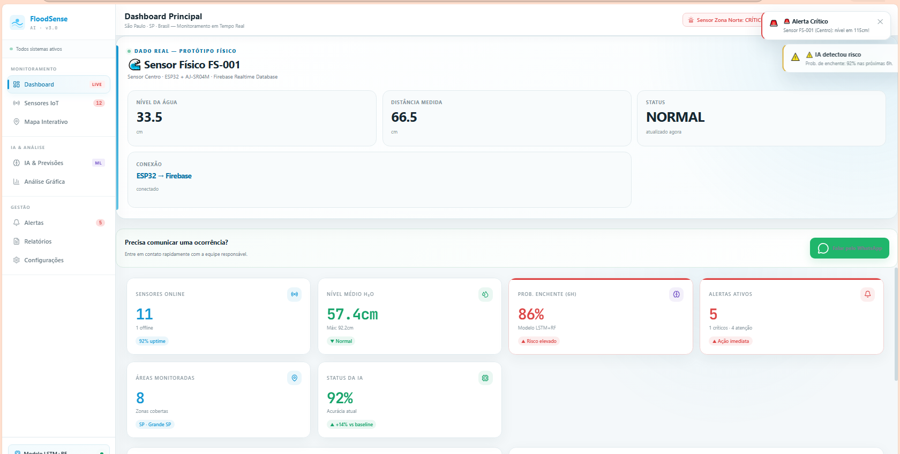

<div align="center">

# 🌊 FloodSense AI

### Sistema Inteligente de Monitoramento e Previsão de Enchentes Urbanas

**IoT • ESP32 • AJ-SR04M • Firebase • Dashboard Web**

<br>

[](https://leila533.github.io/floodsense-ai/)
[](https://github.com/leila533/floodsense-ai)

<br><br>

<div align="center">

<a href="https://leila533.github.io/floodsense-ai/">

</a>

</div>

<br>


</div>

---

## 🌧️ Sobre

O **FloodSense AI** é um projeto acadêmico desenvolvido no curso de **Sistemas de Informação da Universidade Paulista — UNIP**.

A solução propõe o uso de **Internet das Coisas (IoT)** para realizar o monitoramento de níveis de água por meio de um sensor ultrassônico conectado a um **ESP32**, enviando os dados para a nuvem e disponibilizando as informações em um **dashboard web**.

O projeto foi desenvolvido como um **protótipo/MVP acadêmico**, permitindo demonstrar a integração entre hardware, software e serviços em nuvem.

---

## 🚀 Demonstração

<div align="center">

### 🌊 FloodSense AI — Sistema Online

<br>

<a href="https://leila533.github.io/floodsense-ai/">

</a>

<br><br>

**Acesse diretamente pelo navegador:**

### https://leila533.github.io/floodsense-ai/

</div>

---

## 💡 Como funciona

O sistema possui um fluxo simples de coleta e disponibilização dos dados:

```text
📏 AJ-SR04M
Sensor ultrassônico
       │
       ▼
🔌 ESP32
Coleta dos dados
       │
       ▼
📶 Wi-Fi
       │
       ▼
☁️ Firebase
Realtime Database
       │
       ▼
🖥️ FloodSense AI
Dashboard Web

📡 Protótipo físico

O projeto possui um protótipo físico real desenvolvido para demonstrar a coleta e transmissão dos dados.

Componentes

🔌 ESP32
Microcontrolador responsável pela coleta e processamento das informações.

📏 AJ-SR04M
Sensor ultrassônico utilizado para realizar as medições de distância.

📶 Wi-Fi
Responsável pela comunicação entre o ESP32 e a infraestrutura em nuvem.

☁️ Firebase Realtime Database
Utilizado para armazenar e disponibilizar os dados recebidos do protótipo.

🖥️ Dashboard

O dashboard foi desenvolvido para centralizar as informações do sistema em uma única interface.

Principais recursos

|     | Recurso                    |
| --- | -------------------------- |
| 📊  | Monitoramento do sistema   |
| 📡  | Dados do sensor físico     |
| 💧  | Nível da água              |
| 📏  | Distância medida           |
| 🚨  | Indicadores e alertas      |
| 🗺️ | Visualização em mapa       |
| 📈  | Gráficos e análises        |
| 🤖  | Área de IA e previsões     |
| 📱  | Comunicação de ocorrências |

🤖 Inteligência Artificial

O FloodSense AI possui uma proposta de utilização de Inteligência Artificial e Machine Learning para análise dos dados e apoio à identificação de situações de risco.

A IA faz parte da proposta tecnológica do projeto e é apresentada dentro do contexto de um protótipo acadêmico.

ℹ️ Transparência: algumas informações apresentadas no dashboard são simuladas ou demonstrativas. O projeto não é apresentado como uma plataforma operacional de previsão de enchentes em produção.

☁️ Arquitetura
<div align="center">

📡 SENSOR

AJ-SR04M

↓

🔌 IoT

ESP32

↓

📶 CONECTIVIDADE

Wi-Fi

↓

☁️ CLOUD

Firebase Realtime Database

↓

🖥️ APLICAÇÃO

FloodSense AI Dashboard

</div>
🔐 Segurança

A segurança foi considerada durante a definição da solução, especialmente nos aspectos relacionados à comunicação, armazenamento e controle de acesso.

Conceitos considerados
🔒 Proteção de dados
🛡️ Controle de acesso
🔐 Comunicação segura
✅ Validação de informações
☁️ Segurança da infraestrutura

⚠️ O FloodSense AI é um protótipo acadêmico. Algumas configurações utilizadas durante os testes foram simplificadas para a demonstração. Uma implementação em produção exigiria autenticação, regras de acesso, gerenciamento seguro de credenciais e validação adequada dos dados.

🧪 Validação

O protótipo foi utilizado para validar a integração entre os principais componentes:

Sensor → ESP32 → Wi-Fi → Firebase → Dashboard

Durante os testes, o sensor realizou medições físicas e o ESP32 transmitiu os dados para o Firebase, possibilitando sua visualização na interface web.

🛠️ Tecnologias
<div align="center">

|         Área         | Tecnologias                |
| :------------------: | -------------------------- |
|    🔌 **Hardware**   | ESP32 • AJ-SR04M           |
|      🌐 **Web**      | HTML5 • CSS3 • JavaScript  |
|     ☁️ **Cloud**     | Firebase Realtime Database |
|    📦 **Runtime**    | Node.js                    |
|      💻 **IDE**      | Visual Studio Code         |
| 📚 **Versionamento** | Git • GitHub               |
|     🚀 **Deploy**    | GitHub Pages               |

📁 Estrutura

floodsense-ai/
│
├── 📁 assets/
├── 📁 firmware/
│
├── 📄 index.html
├── 📄 script.js
├── 🎨 style.css
├── 📦 package.json
└── 📦 package-lock.json

👥 Equipe
👩‍💻 Leila Victoria Lima Borges

Desenvolvimento • Integração • Protótipo

Responsável pelo desenvolvimento e integração técnica do projeto:

Desenvolvimento do sistema web
Desenvolvimento do dashboard
Implementação do protótipo físico
Integração ESP32 + AJ-SR04M
Integração ESP32 + Firebase
Testes e validação
Correções e ajustes do sistema
Revisão dos slides
Revisão da documentação
Montagem da apresentação
Integração geral do projeto
👨‍💻 Pedro Gustavo Figueira Bezerra

Slides • Material visual • Apresentação

Responsável por:

Elaboração dos slides
Organização do material visual
Preparação da apresentação
Participação na apresentação oral
👨‍💻 Vagner de Araújo Lima

Documentação • Apresentação

Responsável por:

Desenvolvimento da documentação
Organização das informações técnicas
Estruturação documental
Participação na apresentação oral
🎤 Apresentação do TCC

A apresentação oral do projeto será realizada por:

<div align="center">
👨‍💻 Pedro Gustavo Figueira Bezerra
👨‍💻 Vagner de Araújo Lima
</div>

Os integrantes apresentarão o projeto em nome da equipe durante a avaliação acadêmica.

🎓 Universidade Paulista — UNIP
<div align="center">

Sistemas de Informação

2026

<br>
🌊 FloodSense AI

Tecnologia para transformar dados em informação e apoiar o monitoramento de enchentes urbanas.

<br>

🌊 ACESSAR O SISTEMA

</div>

<div align="center">
🟢 MVP / PROTÓTIPO ACADÊMICO

Hardware + IoT + Cloud + Dashboard + Análise de Dados

</div> ```
